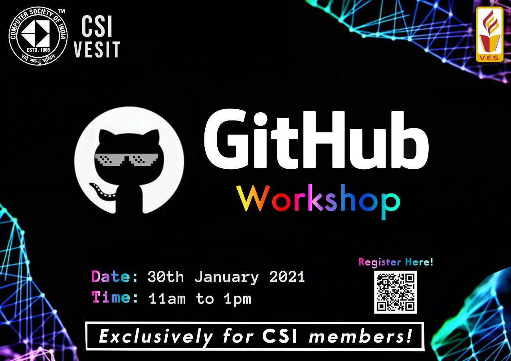

The workshop was divided into 2 parts:
- [x] **Part 1 -** Introduction to Version Control, Git Basics and Branching
- [x] **Part 2 -** Introduction to GitHub, GitHub Gist, Project Boards, Pull Requests, Open Source Best Practices
